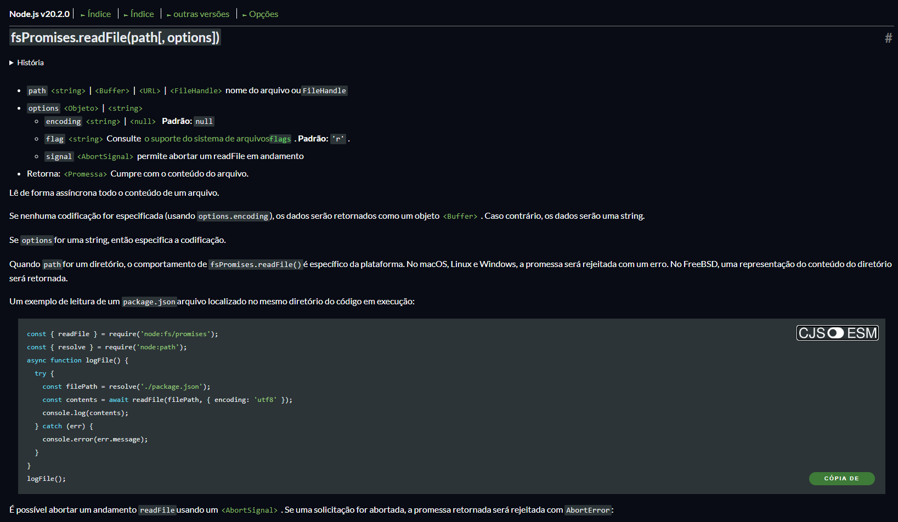
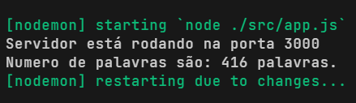

# Desafio: Contador de palavras
Crie um programa Node.js que conte o número de palavras em um determinado texto. O programa deve ser capaz de ler um arquivo de texto e retornar o número de palavras encontradas.

## Requisitos:
- Crie um arquivo contadorPalavras.js e inicie um novo projeto Node.js.
- Crie uma função chamada contarPalavras que recebe o caminho de um arquivo de texto como parâmetro.
- Dentro da função contarPalavras, leia o conteúdo do arquivo de texto.
- Conte o número de palavras no texto lido. Considere que as palavras são separadas por espaços em branco.
- Retorne o número de palavras encontradas.
- No final do arquivo contadorPalavras.js, chame a função contarPalavras e passe o caminho de um arquivo de texto existente como argumento.
- Imprima o resultado do contador de palavras no console.

## Dicas:
- Você pode usar a biblioteca fs (File System) do Node.js para ler o conteúdo do arquivo.
- Considere que o arquivo de texto está em formato de texto simples (.txt).
- Seu desafio é implementar a lógica necessária para contar as palavras no arquivo de texto e imprimir o resultado no console.


# Resolução
Estou muito feliz em realizar esse mini projeto em Node.js.<br/>
Para resolver esse desafio:

#### 1. Comecei abrindo o server Node com Express.js:

```javascript
const express = require('express');
const app = express();
const port = 3000;

app.listen(port, () => {
  console.log(`Servidor está rodando na porta ${port}`);
});
```
Bem simples!

#### 2. Fiz a função de contador de palavras:
Comecei lendo um pouco a documentação do Node.js sobre como ler os arquivos de texto, usando a lib nativa do Node "File System":

E após isso já apliquei na minha função.

```javascript
// Importações
const { readFile } = require('node:fs/promises');
const { resolve } = require('node:path');

// Função assincrona
const wordsCounter = async () => {
  try {
    // Diretório do arquivo usando resolve()
    const filePath = resolve('./texts/javascript-history.txt');
    // Com a função readFile() lemos o arquivo de texto.
    const content = await readFile(filePath, {encoding: 'utf-8'});
  }
  // Tratamento de erro
  catch (err) {
    console.log(`Erro ao ler o arquivo!`, err);
  }
};
```

#### 3. Parte lógica
Para a parte lógica foi muito simples, peguei todo o texto do arquivo, fiz um array com as palavras do texto, e depois salvei a qualtidade de itens (palavras) desse array em uma constante.
```javascript
//const wordsCounter = async () => {
//  try {
//    const filePath = resolve('./texts/javascript-history.txt');
//    const content = await readFile(filePath, {encoding: 'utf-8'});
    const words = content.split(" ");
    const wordsCount = words.length;
    console.log(`Numero de palavras são: ${wordsCount} palavras.`);
    return wordsCount;
//  }
//  catch (err) {
//    console.log(`Erro ao ler o arquivo!`, err);
//    return 0;
//  }
//};
```

#### 4. Chamamos a função `wordsCounter()` no servidor
Agora para a gente retornar o resultado no nosso servidor, fazemos um GET e chamamos nossa função. E com o `send()` retornamos o valor em tela.

```javascript
const wordsCounter = require('./wordsCounter');

app.get('/', async (req, res) => {
  const wordsCount = await wordsCounter();
  res.send(`Número de palavras são: ${wordsCount} palavras.`);
});
```


## Obrigado
até mais...